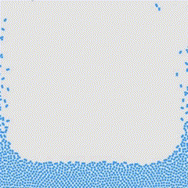
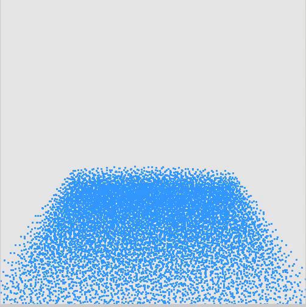
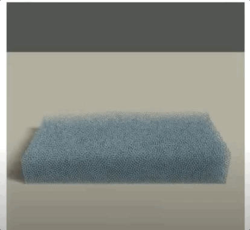

Postion-based fluid simulation

implemented method:

|      | openGL | taichi |
| ---- | ------ | ------ |
| 2D   | √      | √      |
| 3D   | √      | √      |

demo:

- 2D PBF (openGL): 
  

- 3D PBF (openGL): 

  

  Takeaways: 

  - cell_size/... hyperparameters tuning matters.
  - CUDA is important for accelerating rendering process.

---

current solution: use **Taichi** to do the particle simulation. (which is fast)

output files: `.ply`

render SW: **Blender** (prefered) / **MeshLab**

expected result:

  

  > we haven't visualized yet, this is the expected result parsed from internet...